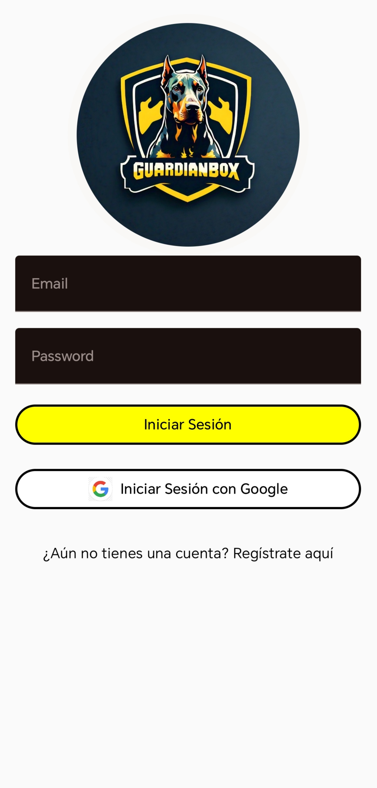
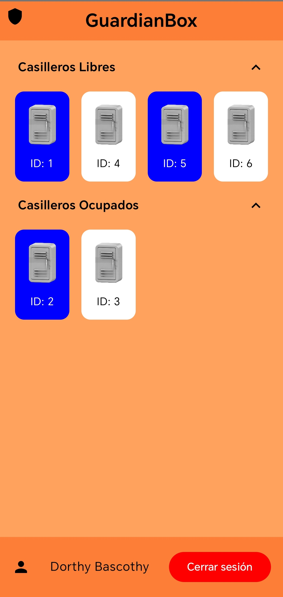
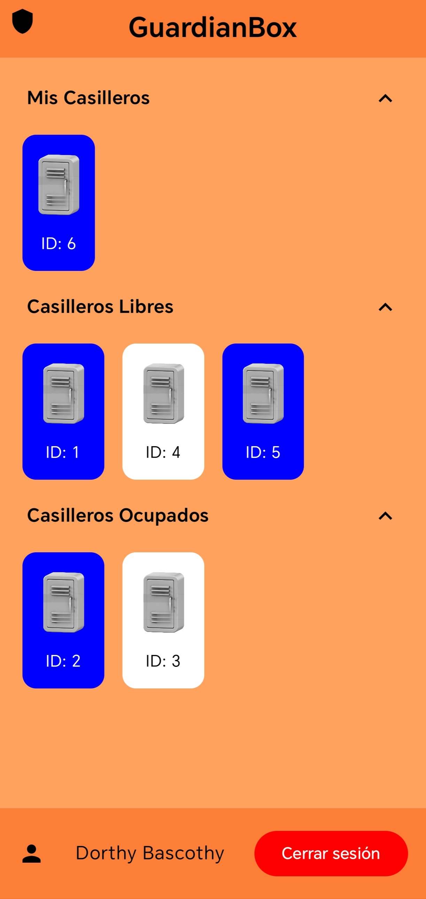
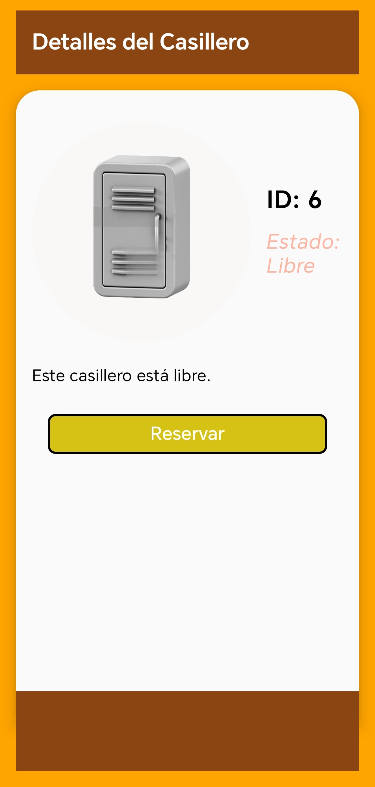
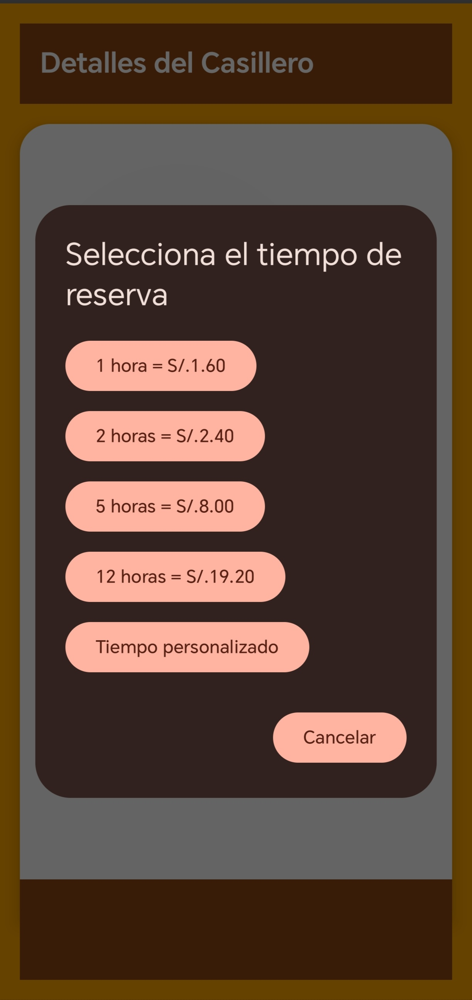
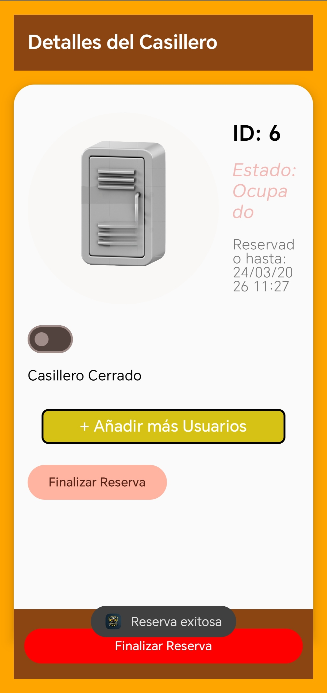
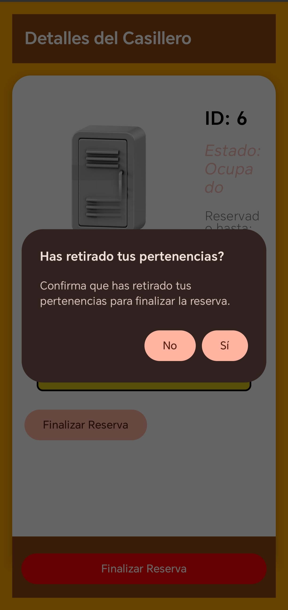

# GuardBox64 (WasabiDefinitive) 🔒
[English](#english) | [Español](#español)

## English
A modern native Android application built with **Kotlin**, **Jetpack Compose**, and **Firebase** for remote and smart management of institutional or university smart lockers.

### 🚀 Key Features
*   **Real-time Management**: Immediate visualization of occupancy status and locker opening via Firebase Realtime Database.
*   **Secure Authentication**: Traditional email login integration and quick access via **Google Sign-In**.
*   **Booking System**: Time allocation (1h, 2h, 5h, 12h, etc.) calculating transparent pricing instantly.
*   **Shared Access Control**: Ability to securely share a timed digital key with other authorized email addresses.
*   **Countdown and Secure Completion**: Step-by-step process for withdrawing belongings without abrupt time cutoff.

---

### 📸 UI Visual Demonstration

#### 1. Authentication (Login)
<p align="center">
  
</p>

#### 2. Main Dashboard (Locker List)
Here the user visualizes all lockers in the network with their color-coded status (Free, Occupied, or Blocked).
<p align="center">
  
  
</p>

#### 3. Locker Detail
Allows checking location, price, and availability before starting an order.
<p align="center">
  
</p>

#### 4. Pricing and Time Booking
Automatic calculation of pricing according to predetermined or custom set hours.
<p align="center">
  
</p>

#### 5. Ownership and Extended Modes
Once a locker is assigned, the user gains extended privileges like remote Open/Close or adding more people.
<p align="center">
  
</p>

#### 6. End-of-Session Security System
5-second countdown timer to warn of general logical closure, allowing last-millisecond cancellations.
<p align="center">
  
</p>

---

### 🛠 Technical Environment and Architecture
- **Kotlin 1.9** + Android SDK 34
- **Jetpack Compose**: Full declarative design, no legacy XML layout support (Except base manifest).
- **MVVM**: Separation of Concerns in Model, View, and User Interactions (ViewModel for state and business logic).
- **Firebase Authentication**: Federated credentials (Google) and Identity Providers.
- **Firebase Realtime Database**: Native asynchronous websockets for the NoSQL database engine and reactivity.

### 📦 Installation and Deployment (Local)

1. Clone this repository.
2. Create a new project in **Firebase Console**.
3. Activate services: Authentication (Email and Google) and Realtime Database (In Test Mode for development).
4. Generate the Android Studio `SHA-1` signature and register the App in Firebase.
5. Download the `google-services.json` file and place it in the `app/google-services.json` path.
6. Compile the project using Android Studio or local Gradle:
   ```bash
   ./gradlew assembleDebug
   ```
7. The final `.apk` file will be located in `app/build/outputs/apk/debug/`.

---

### 📂 Key Folder Structure

```text
WasabiDefinitive/
├── app/
│   ├── src/main/java/com/example/guardbox64/
│   │   ├── model/         # Data classes (Locker, Repository)
│   │   ├── navigator/     # Route control (NavGraph)
│   │   ├── ui/
│   │   │   ├── screens/   # Jetpack Compose Views (Login, Details)
│   │   │   └── viewmodel/ # State handling and Firebase logic
│   │   └── utils/         # Secondary utilities
│   ├── google-services.json.example # Base environment variables file
│   └── build.gradle.kts   # Modular configuration
├── docs/                  # Documentation and graphic resources
└── build.gradle.kts       # Root dependency configuration
```

---

## Español
Una aplicación nativa de Android moderna construida con **Kotlin**, **Jetpack Compose** y **Firebase** para la gestión remota e inteligente de casilleros (smart lockers) institucionales o universitarios.

### 🚀 Características Principales
*   **Gestión en Tiempo Real**: Visualización inmediata del estado de ocupación y apertura de los casilleros gracias a Firebase Realtime Database.
*   **Autenticación Segura**: Integración de inicio de sesión por correo tradicional y acceso rápido vía **Google Sign-In**.
*   **Sistema de Reservas**: Asignación de tiempo (1h, 2h, 5h, 12h, etc.) calculando precio transparente al instante.
*   **Control de Acceso Compartido**: Capacidad de compartir llave digital temporizada con otros correos electrónicos autorizados en forma segura.
*   **Cuenta Regresiva y Finalización Segura**: Proceso paso a paso para retirar pertenencias sin cortar tiempo abruptamente.

---

### 📸 Demostración Visual de la Interfaz

#### 1. Autenticación (Login)
<p align="center">
  
</p>

#### 2. Panel Principal (Lista de Casilleros)
Aquí el usuario visualiza todos los casilleros de la red con su estado codificado por color (Libres, Ocupados o Bloqueados).
<p align="center">
  
  
</p>

#### 3. Detalle de Casillero
Permite revisar la ubicación, precio y disponibilidad antes de iniciar una orden.
<p align="center">
  
</p>

#### 4. Tarificación y Reserva de Tiempos
Calculo automático de tarifas (pricing) según las horas predeterminadas o configuración de horas personalizadas.
<p align="center">
  
</p>

#### 5. Propiedad y Modos Extendidos
Una vez asignado un casillero, el usuario adquiere privilegios extendidos como Abrir/Cerrar a distancia o Agregar a más personas.
<p align="center">
  
</p>

#### 6. Sistema de Seguridad al Finalizar
Temporizador de cuenta regresiva de 5 segundos para advertir el cierre lógico general, permitiendo cancelaciones de último milisegundo.
<p align="center">
  
</p>

---

### 🛠 Entorno Técnico y Arquitectura
- **Kotlin 1.9** + SDK de Android 34
- **Jetpack Compose**: Diseño declarativo completo, sin soporte heredado de layouts XML (Excepto el manifest base).
- **MVVM**: Separation of Concerns en Modelo, Vista e Interacciones del Usuario (ViewModel de estado y lógica de negocio).
- **Firebase Authentication**: Credenciales federadas (Google) e Identity Providers.
- **Firebase Realtime Database**: Websockets nativos asíncronos para el motor de bases de datos NoSQL y reactividad.

### 📦 Instalación y Despliegue (Local)

1. Clonar este repositorio.
2. Crear un nuevo proyecto en **Firebase Console**.
3. Activar los servicios: Authentication (Activando Correo y Google) y Realtime Database (En Test Mode para desarrollo).
4. Generar la firma `SHA-1` de Android Studio y registrar la App en Firebase.
5. Descargar el archivo `google-services.json` y colocarlo dentro de la ruta `app/google-services.json`.
6. Compilar el proyecto usando Android Studio o mediante el Gradle local:
   ```bash
   ./gradlew assembleDebug
   ```
7. El archivo final `.apk` se ubicará en `app/build/outputs/apk/debug/`.

---

### 📂 Estructura de Carpetas Clave

```text
WasabiDefinitive/
├── app/
│   ├── src/main/java/com/example/guardbox64/
│   │   ├── model/         # Clases de datos (Locker, Repository)
│   │   ├── navigator/     # Control de rutas (NavGraph)
│   │   ├── ui/
│   │   │   ├── screens/   # Vistas de Jetpack Compose (Login, Details)
│   │   │   └── viewmodel/ # Manejo de estados y lógica Firebase
│   │   └── utils/         # Utilidades secundarias
│   ├── google-services.json.example # Archivo base de variables de entorno
│   └── build.gradle.kts   # Configuración modular
├── docs/                  # Documentación y recursos gráficos
└── build.gradle.kts       # Configuración raíz de dependencias
```
